# Week2
## T1
### code:
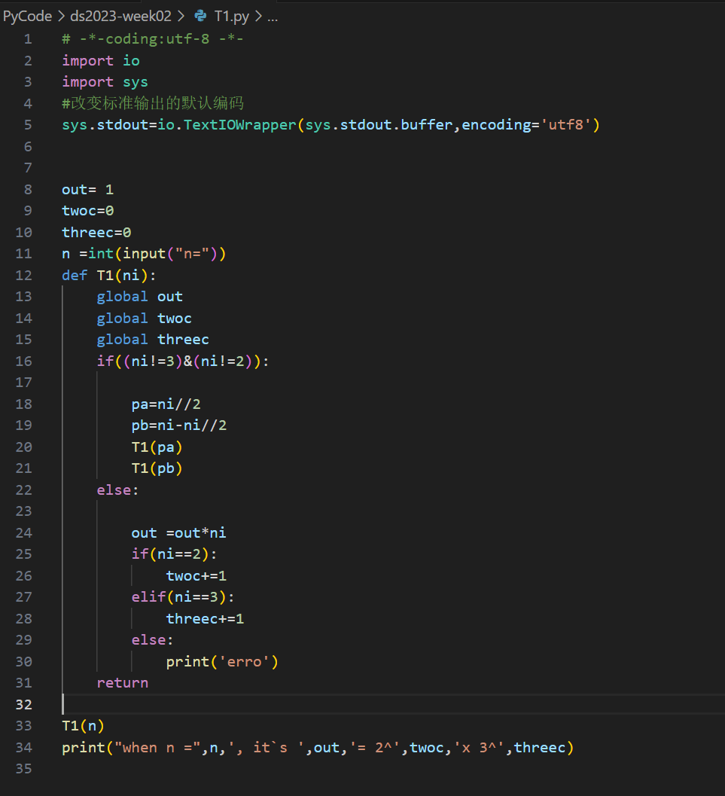
### result:
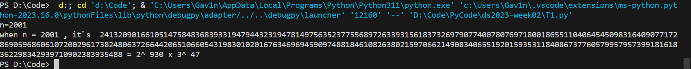

## T2
### code:
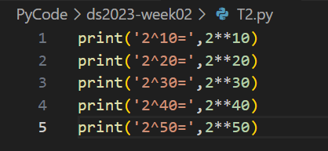
### result:
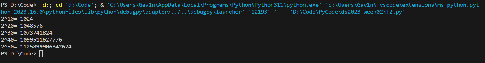

## T3
### code:
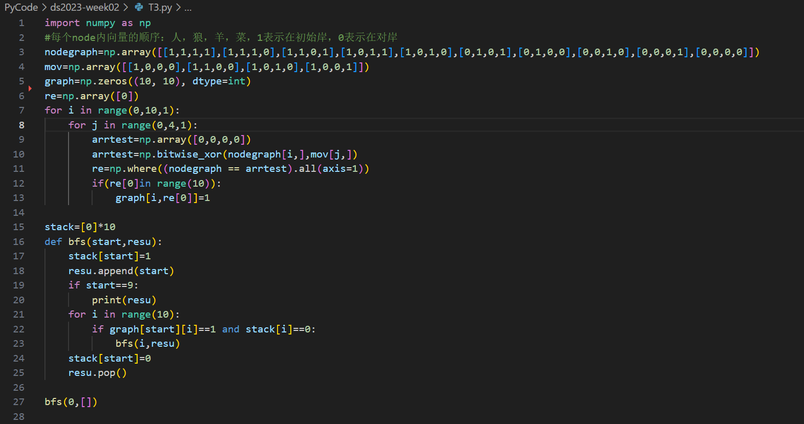
### result:
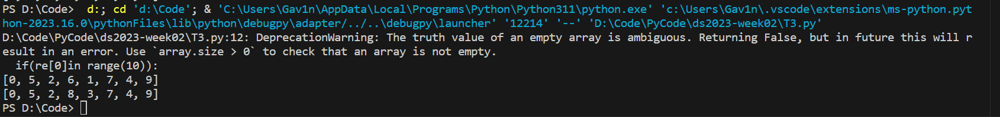

## T4
### code:
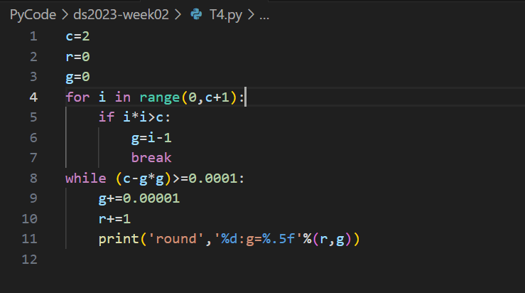
### result:
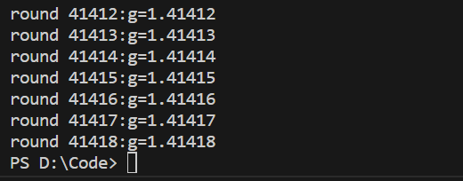

## T5
### code:
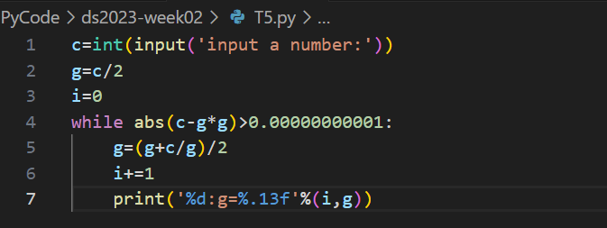
### result:
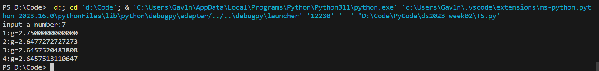

## T6
### code:
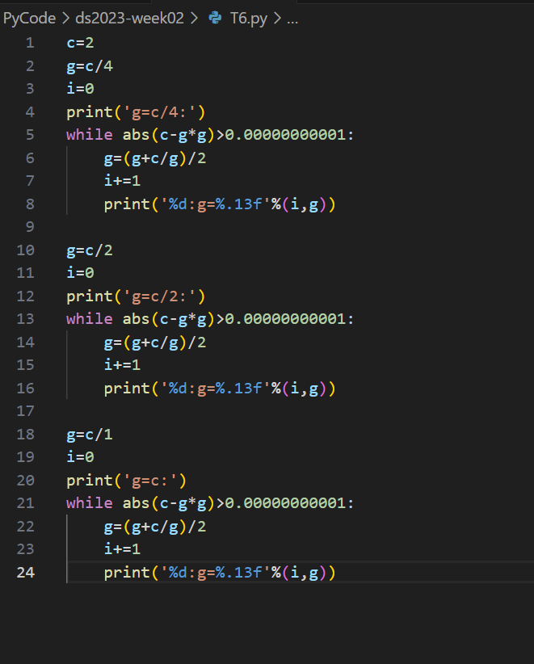
### result:
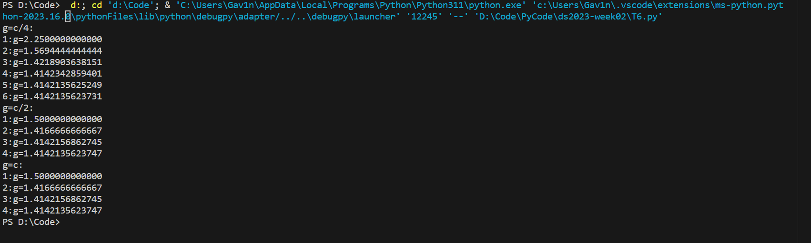

## T7
### code:
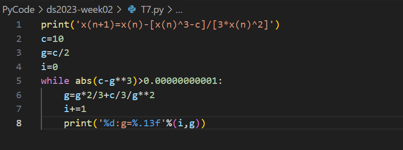
### result:
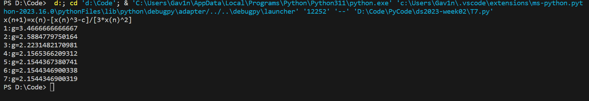

## T8
### code:
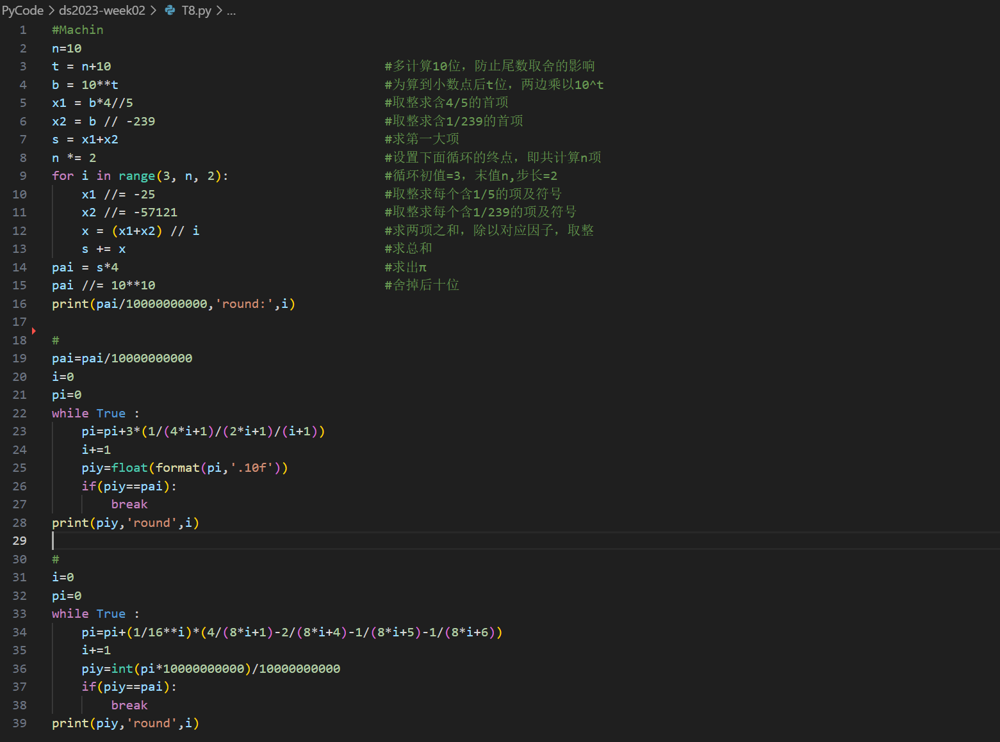
### result:
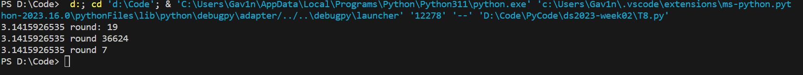

## T9
### code:
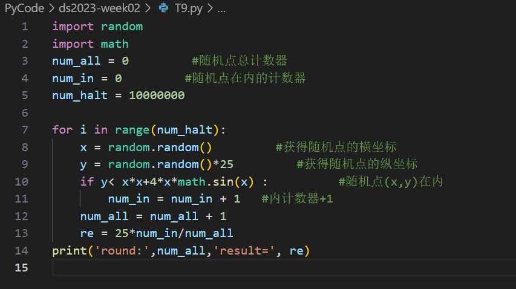
### result:
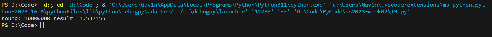
