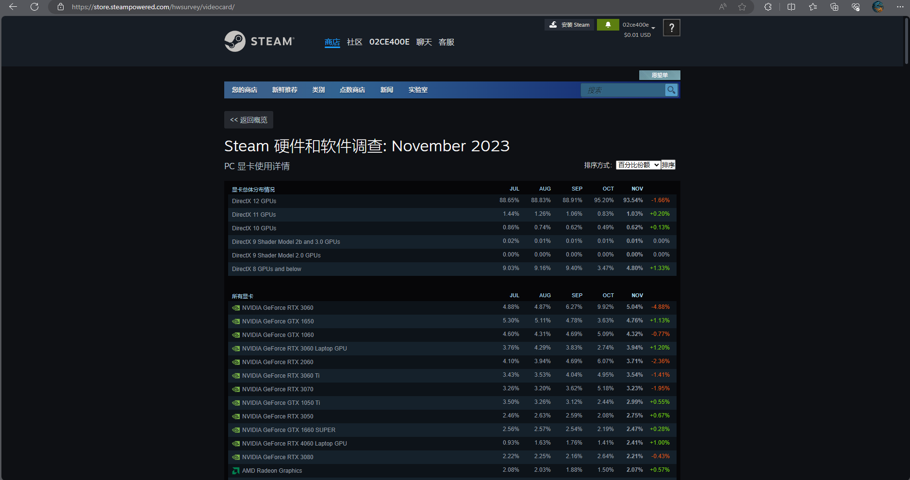
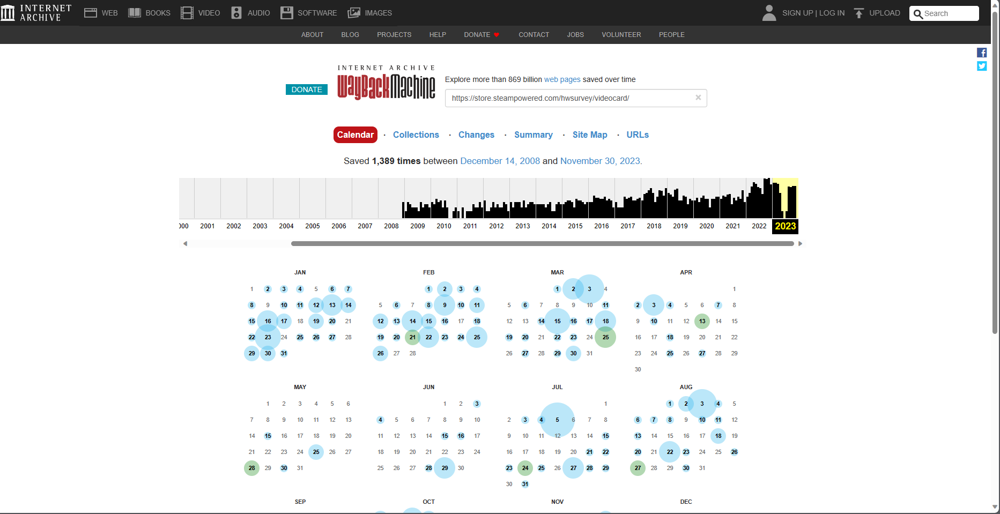
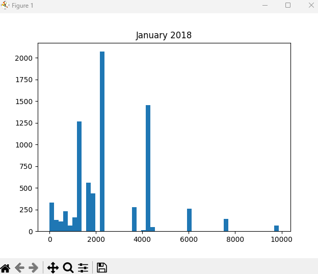
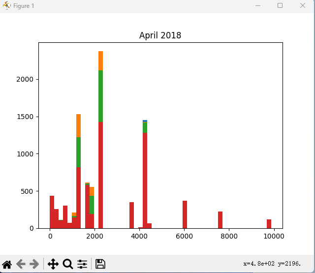
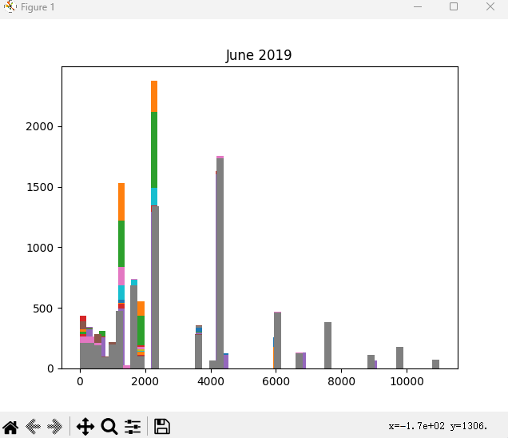
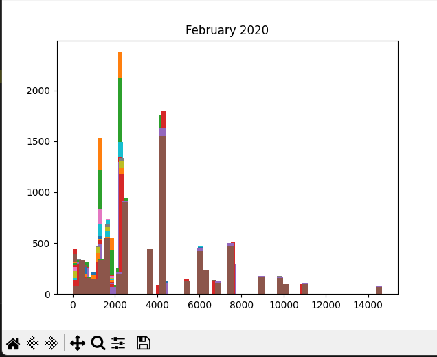
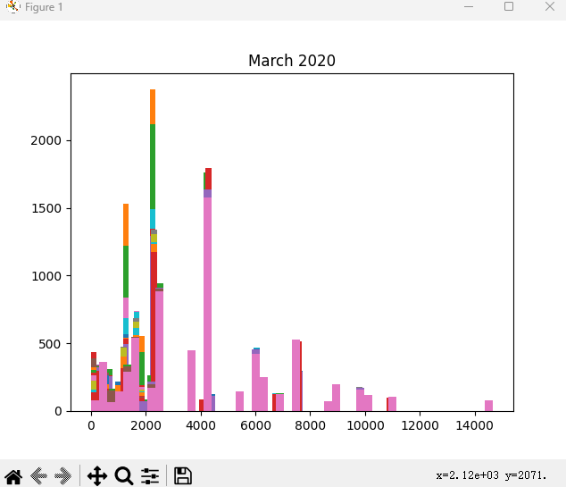
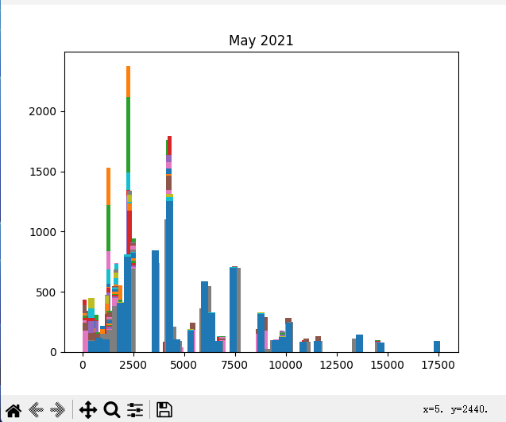
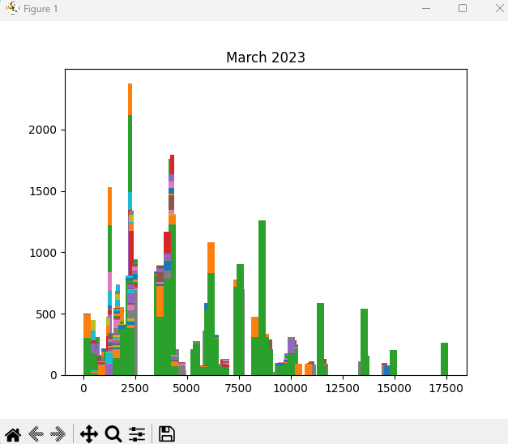

# 2018-2023五年间玩家群体中gpu型号的调查

唐硕10225101447

我们常提到摩尔定律在逐渐失效，然而工业界仍然能够努力通过各种优化维持年10%以上的提升，然而在消费端的情况会有所不同吗？这次作业关注了在个人PC中关注度最高的显卡部分，希望能展示消费者手中的gpu在过去五年发生了怎样的变化。
 

## 数据的获取
这里采用了在线游戏服务平台steam每月发布的玩家软硬件调查报告作为数据来源。
 
使用爬虫获取所有GPU类别中占比前30的型号和占比。这里遇到的问题是steam硬件调查报告并不提供往期链接，steamDB数据库中也不开放相关的数据。解决方案是通过time machine网站寻找历史网页的快照，
 
然后爬取相关信息，通过xlwt库函数写入.xls表格文件。
中途遇到两件插曲，一是steam硬件报告格式并不统一，2021年前后网页的格式发生变化，而在2021年前后，都有展示五列，四列和三列历史数据的网页类型，xpath解析需要按情况选择。
二是urllib3中https支持与代理软件的冲突问题，由于urllib3和pip自带的urllib库在最近的版本真正支持了https，而代理文件中写法还是默认使用http，需要更新proxies写法。

## 数据处理
首先预处理统一所有名称，让不同的GPU与对应数据形成字典，删除了steam硬件报告中有些年份报告中异常的空格，确保统计时不会额外计算，其次删除了统计时没有明确的型号仅有制造商的数据。
其次，获得的源数据是按每个月份占比的多张表格，利用pandas的dataframe结构体方便遍历和索引的特性将数据转化为方便制图的单张表格，
利用字符匹配新增制造商一栏，但随后的动态图展示解释了这必要性不大。
绘制以日期为轴动态展示前十位占比的gpu型号的条形图。
 

## 探索分析
根据动态条形图我们可以发现：

1，GTX1060是一张现象级的产品，在过去五年的时间内这张2016年末发布的产品都占据着市场占有率的榜首，并且一度达到15%以上，这是其他型号从未做到过的，直到2022年末才被取代，至今仍然存在于榜单上，以至于甚至不需要生成词云都可以将其作为过去五年gpu市场的关键词。

2，过去五年最受欢迎的GPU制造商毫无疑问是NVIDIA，在五年内仅仅有一款来自其他制造商的GPU进入占有率前十，是AMD的RX580，在2020年短暂到达8-9名的成绩，而他对标的产品正是上面提到的GTX1060。这个结果即使放到前30位也是基本相同，与不同厂家新品发布之后在网络上都有很高讨论的热度不同，在现实中NVIDIA已经基本做到了实质上的垄断。

3，在产品从10，16，20，30系迭代的过程中再没有型号能复刻1060的成功，在1060的生涯末期经历了相对混乱的时段，最高占比的显卡也只有5%上下，而2023年新晋的宠儿是rtx 3060,有望达到15%的占有率接替1060的位置。
合理推断在大部分玩家群体中一款gpu的生命周期大概是5-7年

## 挖掘
仅仅依靠市场占有率的变化我们并不清楚gpu性能的变化，还需要引入新的数据。这里从3dmark数据库爬取主流型号的测试成绩。选取的测试项目是体现dx12 api下图形性能的time spy测试，匹配到表格数据性能一栏。
然后绘制图像，以性能（time spy得分）为横轴，按比例采样的样本数为纵轴，得到以下变化的图像：

 

图像起初呈现类似gamma分布的态势，逐渐转变为更加符合正态分布的模样，我试图使用scipy拟合这些图像，但问题在于由于gpu行业NV的一家独大，少量产品对应的性能分布过于离散，所有分布模型即使放宽到200秒的拟合时间误差仍然很大，因此消费者的选择其实很有限。
第一阶段是从2018年至2019年，timespy 2000分左右的显卡大量淘汰，性能上限上探到14000分以上，4000分成为中位成绩，然而2000分以下的图形性能已经完全落后的显卡保有量仍然很大。
此后维持这个趋势，2020-2021年的变化都不大，这与疫情期间消费乏力，电子产品由于供应链涨价不无关系。直到2023年中期，7000分挡位才迅速取代4000分挡位成为新的中位性能标杆，而4000分到7000分，刚好是1060到3060的跨度。
由此得出的结论是，虽然每18个月性能翻倍的摩尔定律并不适用于消费者端，然而更多的消费者还是会在性能提升达到两倍的时候才会有更高的更新硬件的热情，玩家手中的硬件性能完成了从2000分到4000分到7000分的跨越，而这刚好对应了对图形性能要求较低的场景、1080p下的图形性能需求和2k下的图形性能需求，而steam硬件报告同样指出在2023年上半年2k分辨率的显示器占有率大幅上升，2k对比1080p的像素点数量刚好又是2倍。
虽然消费品代际之间的性能提升已经无法维持每代提升一倍，然而消费者只有面对双倍于现有的性能才会有更新硬件的动力，似乎也是对抗这种没有充分竞争的市场的一种反应。

## 总结
这次作业并不理想，很多方法无法应用，我归结的原因在于数据量，gpu市场是一个竞争并不充分近乎于垄断的市场，更新速率不快，五年前的显卡往往难以找到与现状统一标准的测试成绩，而占据消费者主流的入门型号算力信息又很少，相关性能数据往往聚焦高端产品，因此出现了信息与实际保有量的倒挂，真正的主流产品有关用户数据难以寻找，分布也相当离散。但是意外发现了两倍提升与摩尔定律的巧合，不再是年为单位，不再是18个月，也不再是代际的提升，而是消费者对产品心理预期的提升。